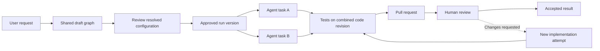

# iDevelop product direction

Updated: 2026-10-03. The user selected C# and Avalonia. Runtime design details remain proposals. No application, provider login, or performance claim has been validated by running iDevelop.

## Confirmed product requirements

iDevelop is a desktop workspace for coordinating coding agents through an editable node graph. The canvas should resemble Miro or Unreal Blueprints. A kanban board is not the primary interface.

The user wants these capabilities:

- Generate a draft workflow from a natural-language request, including tasks, relationships, agents, models, and reasoning settings.
- Edit tasks, connections, prompts, agents, models, and supported reasoning settings manually.
- Review the generated graph before agents begin editing code.
- Collaborate with teammates in real time from the first release.
- Run independently in solo mode without installing or connecting to a server.
- Offer an optional self-hosted server for team synchronization. All agents execute on members' local machines.
- Manage multiple projects and navigate workflow groups, upstream dependencies, downstream dependents, and individual attempts.
- Run independent work concurrently and explain why dependent work is blocked.
- Connect tasks to GitHub issues and pull requests, including human review gates.
- Preserve readable session records that another agent or model can use to continue the work.
- Use existing subscriptions or coding plans where the provider supports that access. Also support ordinary API credentials.
- Ship Windows, macOS, and Linux applications from one codebase, with a modern interface and responsive canvas.
- Prefer an implementation without a JavaScript or TypeScript application stack.
- Use C# and .NET for iDevelop's application code, Avalonia for the desktop UI, and NodifyAvalonia for the initial node canvas. The user declined further framework comparisons.
- Prefer permissively licensed dependencies that allow commercial distribution and company use without mandatory framework fees. Preserve the option of distributing a proprietary product.

The shared server synchronizes workflow information. It does not host coding agents, model calls, terminals, or repositories. Provider authentication and execution stay on the local machine.

## A task is stable while its agent can change

A node represents a task with an expected result. An agent executes an attempt of that task. This distinction preserves the node's history when a user retries it, changes models, or replaces the coding client.

The proposed domain has the following objects:

| Object | Responsibility |
| --- | --- |
| Workspace | Team membership, roles, projects, and shared settings. |
| Project | Repository connections, workflow collection, and available runners. |
| Workflow | Editable graph, groups, and task definitions. |
| Task | Goal, instructions, acceptance criteria, inputs, and desired execution configuration. |
| Connection | A typed relationship between tasks or their artifacts. |
| Run | An approved, immutable workflow version and its execution history. |
| Attempt | One execution of one task, with the actual agent, model, configuration, code revision, and result. |
| Runner | The machine and process authorized to execute attempts. |
| Artifact | A result, patch, commit, test output, handoff, issue, or pull request. |
| Approval | Who approved which graph revision or code revision, and under which policy. |

An agent, model, provider account, and runner are separate choices. A coding client can support several models. A model endpoint alone does not supply a coding agent's tool loop, file permissions, terminal execution, or recovery behavior.

## What PlanWeave establishes

The inspected PlanWeave source is pinned to `8647d015ac562e8fda148415b84ee77e3b3ada89`. Its desktop uses Electron, React, TypeScript, and React Flow. Its graph is backed by tasks, implementation blocks, review blocks, and dependencies. A task node can therefore contain more than one executable block. The implementation supports graph editing, reconnection, and presence. [Graph view](https://github.com/GaosCode/PlanWeave/blob/8647d015ac562e8fda148415b84ee77e3b3ada89/packages/desktop/src/renderer/views/GraphView.tsx), [manifest types](https://github.com/GaosCode/PlanWeave/blob/8647d015ac562e8fda148415b84ee77e3b3ada89/packages/runtime/src/types/manifest.ts)

Its strongest reusable distinction is between an editable canvas document and runtime state. The canvas document contains a manifest, Markdown prompts, and layout. Shared edits carry operation identifiers and expected revisions. The server authorizes and commits accepted commands, and clients catch up after reconnecting. Runtime status uses a separate revision. These are useful contracts for iDevelop even if the renderer and implementation language change. [Canvas document](https://github.com/GaosCode/PlanWeave/blob/8647d015ac562e8fda148415b84ee77e3b3ada89/packages/runtime/src/canvasReplica/document.ts), [command service](https://github.com/GaosCode/PlanWeave/blob/8647d015ac562e8fda148415b84ee77e3b3ada89/packages/server/src/canvas/service.ts), [live sync contract](https://github.com/GaosCode/PlanWeave/blob/8647d015ac562e8fda148415b84ee77e3b3ada89/packages/collaboration-protocol/src/canvasLiveSync.ts), [runtime status](https://github.com/GaosCode/PlanWeave/blob/8647d015ac562e8fda148415b84ee77e3b3ada89/packages/collaboration-protocol/src/runtimeStatus.ts)

Reuse these ideas selectively. PlanWeave's server also coordinates execution operations, which exceeds the requested sync-only server. Its inspected command path can reject stale edits and does not establish character-level collaborative merging. Its manifest does not establish persistent first-class model and reasoning fields for each node. ACP options can supply those values, but iDevelop still needs to persist the intended configuration. [Execution adapter](https://github.com/GaosCode/PlanWeave/blob/8647d015ac562e8fda148415b84ee77e3b3ada89/packages/server/src/canvas/authoritativeExecutionRuntimeAdapter.ts), [ACP configuration](https://github.com/GaosCode/PlanWeave/blob/8647d015ac562e8fda148415b84ee77e3b3ada89/packages/runtime/src/autoRun/acpSessionConfiguration.ts)

The investigation did not establish an enforced human approval state, native GitHub issue and pull-request integration, or worktree ownership that meets iDevelop's requirements. The README labels its collaboration and remote-agent features experimental. Static source inspection does not prove their runtime reliability. PlanWeave's MIT license permits reuse subject to its notice requirements. [PlanWeave README](https://github.com/GaosCode/PlanWeave), [license](https://github.com/GaosCode/PlanWeave/blob/8647d015ac562e8fda148415b84ee77e3b3ada89/LICENSE)

## The first complete workflow

Two teammates open the same project. One describes a change. iDevelop generates a draft graph and shows the proposed agents and dependencies. Both teammates can edit it. The interface shows who is present and makes concurrent edits visible.

Before execution, iDevelop validates the graph and resolves available runner capabilities. It checks dependency cycles, missing inputs, supported model settings, permissions, and authentication readiness. Review applies to a specific execution configuration. A relevant edit invalidates that review. Moving a node on the canvas does not.

An authorized teammate starts the approved version. Ready tasks run on assigned machines. Each concurrent code writer gets an isolated Git worktree and branch. Downstream work receives the required commits or artifacts explicitly. A dependency becoming successful does not magically place its code in another machine's checkout.

Completed implementation reaches its configured test and review gates. A pull request can wait for human review while unrelated branches continue. A rejected review creates a new implementation attempt with the feedback attached. The final session document explains what happened and what remains.

The feedback arrows describe new attempts. They do not introduce a cycle into the dependency graph for a single run version.

## Connections have explicit meanings

A dependency means that the predecessor must meet a named completion condition before the successor becomes ready. A context connection shares information without blocking execution. A review connection names the artifact and revision that a reviewer must accept.

Dependencies use all required predecessors by default. Optional or alternative paths need explicit conditions. Failure blocks affected dependents and shows the causal task. It does not stop unrelated work automatically. Retry limits and human escalation prevent an endless implementation-review loop.

Task readiness is derived from dependencies, required inputs, approvals, runner availability, and quota constraints. Attempt status is recorded separately as queued, running, waiting for input, succeeded, failed, cancelled, or interrupted. A disconnected runner has an unknown outcome until reconciliation establishes what happened. The interface should say why a task is waiting rather than present a generic spinner.

The project tree and the execution graph answer different questions. Groups describe where work belongs. Connections describe what work depends on. The interface needs breadcrumbs, a minimap, search, collapsible groups, and a command to focus the selected task's dependencies.

## Solo mode needs no server

The desktop application contains the local workflow engine, persistence, and runner integration. A solo project can generate, edit, approve, and execute a graph without a team account or server. External model providers and GitHub still need their own network access when used.

Connecting a project to a self-hosted workspace adds collaboration. The application keeps the same task model and local execution engine. A shared project's connection status must be visible. Losing connectivity does not convert it into an independent solo project.

For a disconnected shared project, the proposed default permits reading and draft edits but stops new shared task claims. An already running attempt may checkpoint locally, but cannot publish an authoritative shared completion until ownership is reconciled. Automatic reassignment must not overlap an unconfirmed local process. A user can explicitly fork a shared workflow into a separate solo workflow with a new identity.

## Shared editing and execution have different owners

The proposed team service authorizes edits, stores graph revisions, records approvals, and arbitrates claims from local schedulers. These are synchronization and ownership checks, so the service does more than pass messages between clients. It contains no agent execution engine. Desktop clients render local state immediately and receive shared updates. The system must reject invalid semantic graph changes even when concurrent edits are individually valid.

For the first release, a C# service that orders graph operations can support live collaboration without requiring unrestricted offline merge. Presence and cursor updates are temporary. Prompt editing needs a tested merge or explicit conflict resolution policy. The collaboration protocol and any supporting library remain implementation decisions within the selected .NET stack. Merging edits does not establish that a dependency graph is executable.

VS Code Live Share and JetBrains Code With Me are useful interaction references, but they are not the default libraries to embed. Microsoft's Live Share repository is a feedback and documentation repository. Its separate Live Share SDK targets Teams and Microsoft 365. JetBrains announced Code With Me's sunset, with 2026.1 as the last officially supported IDE version. Prefer a general collaboration library whose data model iDevelop controls. [VS Live Share repository](https://github.com/Microsoft/live-share), [Live Share SDK](https://github.com/microsoft/live-share-sdk), [Code With Me sunset](https://blog.jetbrains.com/platform/2026/03/sunsetting-code-with-me/)

Each scheduled attempt has one execution owner and a claim generation. An obsolete owner cannot publish a successful result after an explicit ownership transfer. The runner records launches durably and reconciles an interrupted attempt before replacement work starts. A disconnected machine is not automatically assumed to have stopped its agent. Local worktrees isolate filesystem changes. External actions need their own duplicate protection because a database claim cannot undo a duplicate GitHub request.

Editing a live workflow creates a new draft version. It does not silently change an active attempt's instructions or model. The user can explicitly cancel, retry, or approve a revised run. Completed artifacts remain available, but reuse requires matching inputs and code revisions.

The team service does not distribute members' personal subscription tokens. Each runner owns its provider authentication. Team permissions separately control who can edit a plan, start work on a machine, use an account, approve results, and administer the workspace.

Workspace login or SSO establishes team identity. Each provider connection still needs its own supported authorization and entitlement. Signing into the team workspace does not grant access to another member's model subscription.

## Markdown preserves meaning across agents

The user should be able to export a complete `SESSION.md` with a section for every task and attempt. It should contain the goal, graph version, configuration, decisions, actions, evidence, outcome, blockers, and next action. Large logs and binary artifacts remain linked from that document in a portable export bundle.

The application should generate this document from structured task and attempt records. Concurrent agents should submit results to the runtime instead of rewriting the same Markdown file. This preserves a readable record without using prose parsing as the scheduler's source of truth.

A portable handoff contains:

- The task and acceptance criteria.
- The repository identity, base commit, resulting commits or patch, and relevant file paths.
- Completed actions and the evidence for each conclusion.
- Commands, observed results, outstanding failures, and unresolved questions.
- Relevant predecessor artifacts and review feedback.
- The next action and any permission or environment requirements.

Changing providers starts a fresh attempt with this handoff and verified artifacts. It does not promise to transfer private reasoning, provider-specific cached state, or native session identifiers. A same-client resume handle can be retained as an optional optimization. The portable record must remain useful without it. Credentials and unfiltered private transcripts do not belong in committed handoffs.

## Agent clients and model APIs are separate integrations

The first integration path controls supported coding clients on a runner. Prefer their documented structured interfaces, including ACP where actually implemented. Use a client-specific adapter when its official interface is better suited. ACP defines local process communication and configurable model and reasoning selectors, but its documentation still describes full remote support as work in progress. A runner can terminate the local protocol and expose iDevelop's own authenticated remote connection. [ACP introduction](https://agentclientprotocol.com/get-started/introduction), [session configuration options](https://agentclientprotocol.com/protocol/v1/session-config-options)

The second path runs an iDevelop-managed coding agent against model APIs. Pi AI is a reference for provider adapters, streaming events, capability discovery, and message conversion. It is not a complete replacement for the agent loop or the workflow scheduler. The [provider access reference](provider-access.md) records the nine requested provider families, all 42 built-in provider identifiers in the inspected Pi snapshot, and unverified access routes.

The C# application can control an installed Pi coding client instead of embedding its TypeScript AI package or immediately porting its entire provider catalog. Direct C# provider adapters can follow where the product needs tighter control. The choice must account for each provider's permitted client and plan, not just whether its endpoint accepts the request.

Controls must show the values actually supported by the chosen agent and model. Do not pretend that every provider implements the same reasoning scale. Persist the requested and effective settings. If an account reaches a quota, pause or request a permitted reassignment. Switching to billable API access requires an explicit policy or user choice.

## GitHub results stay attached to their code revision

An issue node can create or attach an issue. An implementation node can produce a branch and draft pull request. A review gate follows the actual pull request head commit, required checks, and the team's review policy. A new push can invalidate the gate. Agent success, a human approval, and a merged pull request are different facts.

GitHub operations and authentication belong to the local runner in the initial design. The synchronization server shares issue and pull-request references and status. A GitHub App remains an option for scoped repository access, but is not a requirement for running the synchronization service. User-authorized actions must preserve the correct actor. [GitHub App authorization](https://docs.github.com/en/apps/using-github-apps/authorizing-github-apps)

Integration commands need stable operation identifiers and reconciliation after uncertain responses. A local runner can refresh GitHub state without making the shared server a GitHub execution service. If webhook support is added, handlers must validate the sender and deduplicate deliveries. Reconciliation is still needed because GitHub does not automatically redeliver failed webhooks. [Webhook best practices](https://docs.github.com/en/webhooks/using-webhooks/best-practices-for-using-webhooks), [using webhooks](https://docs.github.com/en/webhooks/using-webhooks)

## Selected desktop stack

The user selected C# and Avalonia because they already know both. Use C# and .NET for iDevelop's own application code, including the workflow engine, local runner, and optional synchronization service. Use Avalonia for the desktop interface and BAndysc's `NodifyAvalonia` as the starting node-editor component. Framework comparison work is closed by this decision.

Keep the task, workflow, and attempt model independent of Avalonia controls. The canvas edits the workflow through application operations. The same model supports standalone solo execution and team synchronization. External coding clients can still use their own implementation languages.

Avalonia supports Windows, macOS, and Linux and renders its controls through Skia. Its open-source framework is MIT licensed. Paid products are separate options. [Avalonia platforms](https://docs.avaloniaui.net/docs/supported-platforms), [architecture](https://docs.avaloniaui.net/docs/fundamentals/cross-platform-architecture), [license](https://raw.githubusercontent.com/AvaloniaUI/Avalonia/master/licence.md)

Use the NuGet package `NodifyAvalonia`. The similarly named `Nodify.Avalonia` is a different package, and the original Nodify targets WPF. The inspected port provides selection, connections, zoom, panning, themes, and undo/redo hooks. Its compatibility table names Avalonia 11.1.0 for NodifyAvalonia 6.6.0. This is source evidence, not the selected version pair. Pin a compatible dependency set during implementation. The inspected README lists cutting lines as unsupported. [Port and examples](https://github.com/BAndysc/nodify-avalonia), [package](https://www.nuget.org/packages/NodifyAvalonia), [MIT license](https://github.com/BAndysc/nodify-avalonia/blob/avalonia_port/LICENSE)

Avalonia documents accessibility and IME facilities. The custom graph still needs keyboard interactions and automation support, and the selected implementation must pass those checks. [Accessibility](https://docs.avaloniaui.net/docs/app-development/accessibility), [text input](https://docs.avaloniaui.net/docs/input-interaction/text-input)

A log viewer is not an interactive terminal. Prefer structured agent events for the main interface. If a client requires an interactive terminal, select and validate a suitable .NET integration separately, including process control, escape sequences, selection, and keyboard behavior.

The [selection record](handoffs/2026-10-03-avalonia-selection.md) supersedes the earlier [language comparison](handoffs/2026-10-03-language-and-node-editors.md). Earlier alternatives are historical research, not active prototype tasks.

## Dependency licensing preference

Prefer standard permissive licenses such as MIT, Apache-2.0, and BSD. The intended product should remain usable inside a company and distributable commercially without required framework seats, royalties, or revenue-based fees. Keep proprietary distribution possible without choosing iDevelop's own license yet.

Copyright notices, license text, applicable NOTICE files, and other license conditions still need to be preserved. A permissive framework license does not establish the licenses of every transitive package, font, icon, native library, plugin, or bundled agent binary. Check the exact shipped versions and artifacts when selecting dependencies. Avoid adding a paid or copyleft dependency by default when a suitable permissive alternative exists.

Apply the same dependency preference to the .NET synchronization service and any collaboration library selected during implementation.

This preference concerns software dependency licensing. Model-provider usage and optional hosting can still incur their own costs.

## Verification of the selected implementation

The framework choice is settled. Validate the Avalonia canvas on representative graphs and interaction traces. Use release builds and record machine, GPU, display scale, framework versions, sample count, warm-up, and instrumentation overhead. Measure rendering separately from model response time and network latency. These checks assess the chosen implementation, not competing frameworks.

The implementation should cover these acceptance cases:

- Pan, zoom, select, connect, and edit 500 tasks with 1,000 connections, while status and log updates arrive.
- Inspect a 2,000-task stress case with off-screen culling and group collapse.
- Target a 16.7 ms frame budget for normal interaction on a declared 60 Hz reference device. This is a proposed target, not a measured result.
- Type English and Chinese with an IME, navigate by keyboard, select log text, and use screen-reader task controls.
- Run two desktop clients against one project. Exercise simultaneous prompt edits, node deletion during an edit, connection conflicts, undo, reconnect, and revocation of access.
- Run the entire solo workflow with no team service installed. Connect a separate shared project and verify that losing its connection does not allow duplicate independent execution.
- Race two start requests. Observe one approved run and one launch per attempt. Restart the service and disconnect a runner during execution.
- Change a draft after approval. Verify that unapproved changes cannot execute and that an active run retains its original version.
- Retry a pull-request operation after an ambiguous response. Verify that it links the existing result rather than creating a duplicate.
- Continue a task with a different agent using only the exported handoff and repository artifacts.
- Build and smoke-test on Windows, macOS, and Linux separately. One shared codebase does not remove platform packaging and testing work.

The first working slice should prove two-person graph review, one subscription-backed coding client, one API-backed agent, dependency scheduling, a Markdown handoff, and a GitHub review gate. The provider catalog can include additional documented integrations with their real availability clearly marked. This is delivery sequencing, not removal of the requested provider scope.
