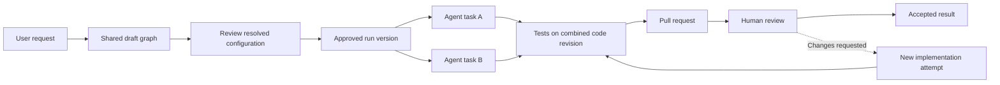
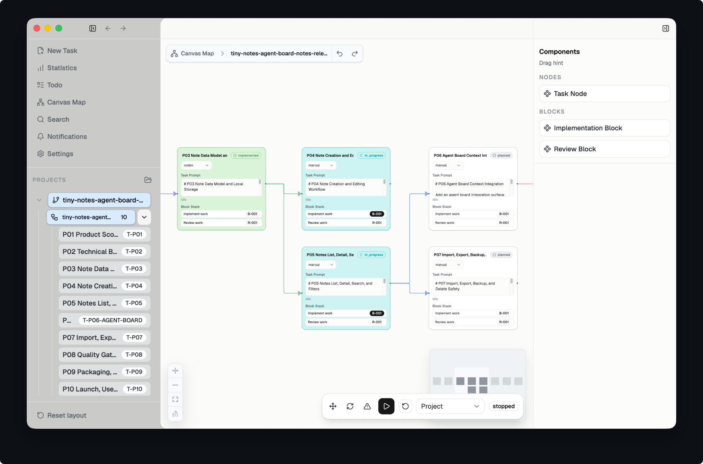

# iDevelop product direction

Updated: 2026-10-07. The desktop app uses C# and Avalonia, follows PlanWeave's look, and runs individual tasks with Claude Code, Codex, Pi, or Antigravity CLI. The node model and editor redesign are built. The user's latest feedback makes workflow execution, multiple open projects and workflows, a clearer inspector, expandable cards, and full agent conversation the next milestone. The user approved the [workspace and execution plan](handoffs/2026-10-06-workspace-execution-plan.md) on 2026-10-06 and later authorized D0, lifting the deferral. Its delivery sequence and verification gates are approved, while the listed open design choices remain to be validated. The [D0 design validation](handoffs/2026-10-06-d0-design-validation.md) is done, including the client capability probe. U1, W1, C1, E1, E2a, and E2b are built. A join needs Git 2.43 or later, and other workflow execution needs Git 2.39 or later. E3 starts after a fresh review confirms its design. Team synchronization remains a first-release requirement. No canvas target in [Verification of the selected implementation](#verification-of-the-selected-implementation) has been measured in iDevelop. C1 measured its Markdown view and message limits on Linux. The [delivery order](#delivery-order) sequences the work.

## Confirmed product requirements

iDevelop is a desktop workspace for coordinating coding agents through an editable node graph. The canvas should resemble Miro or Unreal Blueprints. A kanban board is not the primary interface.

The user wants these capabilities:

- Generate a draft workflow from a natural-language request, including tasks, relationships, agents, models, and reasoning settings.
- Edit tasks, connections, prompts, agents, models, and supported reasoning settings manually.
- Review the generated graph before agents begin editing code.
- Collaborate with teammates in real time from the first release.
- Run independently in solo mode without installing or connecting to a server.
- Offer an optional self-hosted server for team synchronization. All agents execute on members' local machines.
- Manage multiple projects and navigate workflow groups, upstream dependencies, downstream dependents, and individual attempts.
- Run independent work concurrently and explain why dependent work is blocked.
- Connect tasks to GitHub issues and pull requests, including human review gates.
- Preserve readable session records that another agent or model can use to continue the work.
- Use existing subscriptions or coding plans where the provider supports that access. Also support ordinary API credentials.
- Ship Windows, macOS, and Linux applications from one codebase, with a modern interface and responsive canvas.
- Prefer an implementation without a JavaScript or TypeScript application stack.
- Use C# and .NET for iDevelop's application code, Avalonia for the desktop UI, and NodifyAvalonia for the initial node canvas. The user declined further framework comparisons.
- Prefer permissively licensed dependencies that allow commercial distribution and company use without mandatory framework fees. Preserve the option of distributing a proprietary product.
- Restyle the interface to look like PlanWeave's desktop app, with a light theme and a dark theme the user can switch between, as recorded in [The interface follows the PlanWeave look](#the-interface-follows-the-planweave-look).
- Make the node editor work like n8n, Unreal Engine Blueprints, and Godot, with a UI in Apple's design style, as recorded in [The node editor follows Apple's design](#the-node-editor-follows-apples-design).
- Give nodes types that users define and save as blueprints, as recorded in [Nodes have types that users define](#nodes-have-types-that-users-define).
- Provide Run Workflow without requiring a selected starting node. Start successors automatically after all required predecessors finish, and deliver predecessor content explicitly.
- Run any single node. When it finishes, each node directly after it starts automatically once all of that node's predecessors are complete, and nothing starts merely because it comes later. The user asked for this on 2026-10-09 in issue #90. A result from an earlier run counts as complete while it is still current, and when the project's code changed since, while its changes apply cleanly on today's code; on a conflict, its task must run again. The user decided this the same day.
- Keep multiple projects open, with multiple workflows per project. Workflow rows initially hide their node references.
- Preserve the current compact canvas. New and generated nodes start collapsed. Each node and the canvas provide expansion controls. Expanded nodes expose frequent execution settings, agent interaction, attention requests, and result links.
- Provide a chat-quality agent view with Markdown and conversation history. Keep the inspector as the complete settings editor and improve its Godot-inspired alignment, grouping, and field icons.
- Create GitHub issues or pull requests only through an explicit inspector action and user confirmation. Show the resulting references on the node.

The shared server synchronizes workflow information. It does not host coding agents, model calls, terminals, or repositories. Provider authentication and execution stay on the local machine.

## A task is stable while its agent can change

A node represents a task with an expected result. An agent executes an attempt of that task. This distinction preserves the node's history when a user retries it, changes models, or replaces the coding client.

The proposed domain has the following objects:

| Object | Responsibility |
| --- | --- |
| Workspace | Team membership, roles, projects, and shared settings. |
| Project | Repository connections, workflow collection, and available runners. |
| Workflow | Editable graph, groups, and task definitions. |
| Task | Goal, instructions, acceptance criteria, inputs, and desired execution configuration. |
| Connection | A typed relationship between tasks or their artifacts. |
| Run | An approved, immutable workflow version and its execution history. |
| Attempt | One execution of one task, with the actual agent, model, configuration, code revision, and result. |
| Runner | The machine and process authorized to execute attempts. |
| Artifact | A result, patch, commit, test output, handoff, issue, or pull request. |
| Approval | Who approved which graph revision or code revision, and under which policy. |

An agent, model, provider account, and runner are separate choices. A coding client can support several models. A model endpoint alone does not supply a coding agent's tool loop, file permissions, terminal execution, or recovery behavior.

## What PlanWeave establishes

The inspected PlanWeave source is pinned to `8647d015ac562e8fda148415b84ee77e3b3ada89`. Its desktop uses Electron, React, TypeScript, and React Flow. Its graph is backed by tasks, implementation blocks, review blocks, and dependencies. A task node can therefore contain more than one executable block. The implementation supports graph editing, reconnection, and presence. [Graph view](https://github.com/GaosCode/PlanWeave/blob/8647d015ac562e8fda148415b84ee77e3b3ada89/packages/desktop/src/renderer/views/GraphView.tsx), [manifest types](https://github.com/GaosCode/PlanWeave/blob/8647d015ac562e8fda148415b84ee77e3b3ada89/packages/runtime/src/types/manifest.ts)

Its strongest reusable distinction is between an editable canvas document and runtime state. The canvas document contains a manifest, Markdown prompts, and layout. Shared edits carry operation identifiers and expected revisions. The server authorizes and commits accepted commands, and clients catch up after reconnecting. Runtime status uses a separate revision. These are useful contracts for iDevelop even if the renderer and implementation language change. [Canvas document](https://github.com/GaosCode/PlanWeave/blob/8647d015ac562e8fda148415b84ee77e3b3ada89/packages/runtime/src/canvasReplica/document.ts), [command service](https://github.com/GaosCode/PlanWeave/blob/8647d015ac562e8fda148415b84ee77e3b3ada89/packages/server/src/canvas/service.ts), [live sync contract](https://github.com/GaosCode/PlanWeave/blob/8647d015ac562e8fda148415b84ee77e3b3ada89/packages/collaboration-protocol/src/canvasLiveSync.ts), [runtime status](https://github.com/GaosCode/PlanWeave/blob/8647d015ac562e8fda148415b84ee77e3b3ada89/packages/collaboration-protocol/src/runtimeStatus.ts)

Reuse these ideas selectively. PlanWeave's server also coordinates execution operations, which exceeds the requested sync-only server. Its inspected command path can reject stale edits and does not establish character-level collaborative merging. Its manifest does not establish persistent first-class model and reasoning fields for each node. ACP options can supply those values, but iDevelop still needs to persist the intended configuration. [Execution adapter](https://github.com/GaosCode/PlanWeave/blob/8647d015ac562e8fda148415b84ee77e3b3ada89/packages/server/src/canvas/authoritativeExecutionRuntimeAdapter.ts), [ACP configuration](https://github.com/GaosCode/PlanWeave/blob/8647d015ac562e8fda148415b84ee77e3b3ada89/packages/runtime/src/autoRun/acpSessionConfiguration.ts)

The investigation did not establish an enforced human approval state, native GitHub issue and pull-request integration, or worktree ownership that meets iDevelop's requirements. The README labels its collaboration and remote-agent features experimental. Static source inspection does not prove their runtime reliability. PlanWeave's MIT license permits reuse subject to its notice requirements. [PlanWeave README](https://github.com/GaosCode/PlanWeave), [license](https://github.com/GaosCode/PlanWeave/blob/8647d015ac562e8fda148415b84ee77e3b3ada89/LICENSE)

## The target workflow

Two teammates open the same project. One describes a change. iDevelop generates a draft graph and shows the proposed agents and dependencies. Both teammates can edit it. The interface shows who is present and makes concurrent edits visible.

Before execution, iDevelop validates the graph and resolves available runner capabilities. It checks dependency cycles, missing inputs, supported model settings, permissions, and authentication readiness. Review applies to a specific execution configuration. A relevant edit invalidates that review. Moving a node on the canvas does not.

An authorized teammate starts the approved version. Ready tasks run on assigned machines. Each concurrent code writer gets an isolated Git worktree and branch. Downstream work receives the required commits or artifacts explicitly. A dependency becoming successful does not magically place its code in another machine's checkout.

Completed implementation reaches its configured test and review gates. A pull request can wait for human review while unrelated branches continue. A rejected review creates a new implementation attempt with the feedback attached. The final session document explains what happened and what remains.

The feedback arrows describe new attempts. They do not introduce a cycle into the dependency graph for a single run version.

## Nodes have types that users define

On 2026-10-04 the user asked for typed nodes and confirmed these requirements:

- A node has a type, such as implement, plan, architect, or review. An implement node executes a plan with the agent, model, and reasoning setting the user chose. A plan node makes a plan and hands it to implement nodes. An architect node designs.
- Users define their own node types without code. Any node can be saved as a blueprint. Built-in blueprints are read-only, and a user changes one by deriving and saving a new blueprint.
- Placing a node copies its blueprint and records which blueprint and version it came from. A later edit of the blueprint changes only nodes placed afterwards.
- Blueprints live in a personal library in the user's folder and in a project library under `.idp/blueprints/`.
- Node types build on interfaces. A node that needs a capability, such as interaction, implements that capability's interface.
- iDevelop does not depend on PStack or any other skill library. A user's own commands and skills work inside a node.
- A review is a back-and-forth between the implementer and the reviewer, each in its own continuing session, until both agree. It has no round limit, and the user does not have to stop it. Small tickets keep each session small.
- The user can answer, guide, and correct an agent that asks how to proceed. Some nodes never ask. A live terminal is not required.
- A planner usually creates the implement nodes. Nodes may also exist already, be drawn empty and filled later, or have no planner. The long-term goal is to talk to one agent and get the whole workflow.

The [node model record](handoffs/2026-10-04-node-model.md) holds the design, which the user accepted on 2026-10-04 with a change to the review loop. A node type is a blueprint over one of three works: an agent, a review loop, or a person. Review becomes a node, and every planner proposes graph edits that the user approves. A conversation resumes the client's own session, so no process runs while a node waits.

## Connections have explicit meanings

A dependency means that the predecessor must meet a named completion condition before the successor becomes ready. A context connection shares information without blocking execution. The [node model](handoffs/2026-10-04-node-model.md#review-is-a-node-and-connections-express-flow) replaced the review connection with a review node, and format 3 stores only dependency and context connections.

Dependencies use all required predecessors by default. Optional or alternative paths need explicit conditions. Failure blocks affected dependents and shows the causal task. It does not stop unrelated work automatically. Retry limits and human escalation prevent endless retries of a failed attempt. A review loop has no round limit and ends when the implementer and the reviewer agree, as the user decided on 2026-10-04.

Task readiness is derived from dependencies, required inputs, approvals, runner availability, and quota constraints. Attempt status is recorded separately as queued, running, waiting for input, succeeded, failed, cancelled, or interrupted. A disconnected runner has an unknown outcome until reconciliation establishes what happened. The interface should say why a task is waiting rather than present a generic spinner.

The project tree and the execution graph answer different questions. Groups describe where work belongs. Connections describe what work depends on. The interface needs breadcrumbs, a minimap, search, collapsible groups, and a command to focus the selected task's dependencies.

## Solo mode needs no server

The desktop application contains the local workflow engine, persistence, and runner integration. A solo project can generate, edit, approve, and execute a graph without a team account or server. External model providers and GitHub still need their own network access when used.

Connecting a project to a self-hosted workspace adds collaboration. The application keeps the same task model and local execution engine. A shared project's connection status must be visible. Losing connectivity does not convert it into an independent solo project.

For a disconnected shared project, the proposed default permits reading and draft edits but stops new shared task claims. An already running attempt may checkpoint locally, but cannot publish an authoritative shared completion until ownership is reconciled. Automatic reassignment must not overlap an unconfirmed local process. A user can explicitly fork a shared workflow into a separate solo workflow with a new identity.

## Shared editing and execution have different owners

The proposed team service authorizes edits, stores graph revisions, records approvals, and arbitrates claims from local schedulers. These are synchronization and ownership checks, so the service does more than pass messages between clients. It contains no agent execution engine. Desktop clients render local state immediately and receive shared updates. The system must reject invalid semantic graph changes even when concurrent edits are individually valid.

For the first release, a C# service that orders graph operations can support live collaboration without requiring unrestricted offline merge. Presence and cursor updates are temporary. Prompt editing needs a tested merge or explicit conflict resolution policy. The collaboration protocol and any supporting library remain implementation decisions within the selected .NET stack. Merging edits does not establish that a dependency graph is executable.

VS Code Live Share and JetBrains Code With Me are useful interaction references, but they are not the default libraries to embed. Microsoft's Live Share repository is a feedback and documentation repository. Its separate Live Share SDK targets Teams and Microsoft 365. JetBrains announced Code With Me's sunset, with 2026.1 as the last officially supported IDE version. Prefer a general collaboration library whose data model iDevelop controls. [VS Live Share repository](https://github.com/Microsoft/live-share), [Live Share SDK](https://github.com/microsoft/live-share-sdk), [Code With Me sunset](https://blog.jetbrains.com/platform/2026/03/sunsetting-code-with-me/)

Each scheduled attempt has one execution owner and a claim generation. An obsolete owner cannot publish a successful result after an explicit ownership transfer. The runner records launches durably and reconciles an interrupted attempt before replacement work starts. A disconnected machine is not automatically assumed to have stopped its agent. Local worktrees isolate filesystem changes. External actions need their own duplicate protection because a database claim cannot undo a duplicate GitHub request.

Editing a live workflow creates a new draft version. It does not silently change an active attempt's instructions or model. The user can explicitly cancel, retry, or approve a revised run. Completed artifacts remain available, but reuse requires matching inputs and code revisions.

The team service does not distribute members' personal subscription tokens. Each runner owns its provider authentication. Team permissions separately control who can edit a plan, start work on a machine, use an account, approve results, and administer the workspace.

Workspace login or SSO establishes team identity. Each provider connection still needs its own supported authorization and entitlement. Signing into the team workspace does not grant access to another member's model subscription.

## Markdown preserves meaning across agents

The user should be able to export a complete `SESSION.md` with a section for every task and attempt. It should contain the goal, graph version, configuration, decisions, actions, evidence, outcome, blockers, and next action. Large logs and binary artifacts remain linked from that document in a portable export bundle.

The application should generate this document from structured task and attempt records. Concurrent agents should submit results to the runtime instead of rewriting the same Markdown file. This preserves a readable record without using prose parsing as the scheduler's source of truth.

A portable handoff contains:

- The task and acceptance criteria.
- The repository identity, base commit, resulting commits or patch, and relevant file paths.
- Completed actions and the evidence for each conclusion.
- Commands, observed results, outstanding failures, and unresolved questions.
- Relevant predecessor artifacts and review feedback.
- The next action and any permission or environment requirements.

Changing providers starts a fresh attempt with this handoff and verified artifacts. It does not promise to transfer private reasoning, provider-specific cached state, or native session identifiers. A same-client resume handle can be retained as an optional optimization. The portable record must remain useful without it. Credentials and unfiltered private transcripts do not belong in committed handoffs.

## Agent clients and model APIs are separate integrations

The first integration path controls supported coding clients on a runner. Prefer their documented structured interfaces, including ACP where actually implemented. Use a client-specific adapter when its official interface is better suited. ACP defines local process communication and configurable model and reasoning selectors, but its documentation still describes full remote support as work in progress. A runner can terminate the local protocol and expose iDevelop's own authenticated remote connection. [ACP introduction](https://agentclientprotocol.com/get-started/introduction), [session configuration options](https://agentclientprotocol.com/protocol/v1/session-config-options)

The second path runs an iDevelop-managed coding agent against model APIs. Pi AI is a reference for provider adapters, streaming events, capability discovery, and message conversion. It is not a complete replacement for the agent loop or the workflow scheduler. The [provider access reference](provider-access.md) records the nine requested provider families, all 42 built-in provider identifiers in the inspected Pi snapshot, and unverified access routes.

The C# application can control an installed Pi coding client instead of embedding its TypeScript AI package or immediately porting its entire provider catalog. Direct C# provider adapters can follow where the product needs tighter control. The choice must account for each provider's permitted client and plan, not just whether its endpoint accepts the request.

Controls must show the values actually supported by the chosen agent and model. Do not pretend that every provider implements the same reasoning scale. Persist the requested and effective settings. If an account reaches a quota, pause or request a permitted reassignment. Switching to billable API access requires an explicit policy or user choice.

## GitHub results stay attached to their code revision

An issue node can create or attach an issue. An implementation node can produce a branch and draft pull request. A review gate follows the actual pull request head commit, required checks, and the team's review policy. A new push can invalidate the gate. Agent success, a human approval, and a merged pull request are different facts.

GitHub operations and authentication belong to the local runner in the initial design. The synchronization server shares issue and pull-request references and status. A GitHub App remains an option for scoped repository access, but is not a requirement for running the synchronization service. User-authorized actions must preserve the correct actor. [GitHub App authorization](https://docs.github.com/en/apps/using-github-apps/authorizing-github-apps)

Integration commands need stable operation identifiers and reconciliation after uncertain responses. A local runner can refresh GitHub state without making the shared server a GitHub execution service. If webhook support is added, handlers must validate the sender and deduplicate deliveries. Reconciliation is still needed because GitHub does not automatically redeliver failed webhooks. [Webhook best practices](https://docs.github.com/en/webhooks/using-webhooks/best-practices-for-using-webhooks), [using webhooks](https://docs.github.com/en/webhooks/using-webhooks)

## Selected desktop stack

The user selected C# and Avalonia because they already know both. Use C# and .NET for iDevelop's own application code, including the workflow engine, local runner, and optional synchronization service. Use Avalonia for the desktop interface and BAndysc's `NodifyAvalonia` as the starting node-editor component. Framework comparison work is closed by this decision.

Keep the task, workflow, and attempt model independent of Avalonia controls. The canvas edits the workflow through application operations. The same model supports standalone solo execution and team synchronization. External coding clients can still use their own implementation languages.

Avalonia supports Windows, macOS, and Linux and renders its controls through Skia. Its open-source framework is MIT licensed. Paid products are separate options. [Avalonia platforms](https://docs.avaloniaui.net/docs/supported-platforms), [architecture](https://docs.avaloniaui.net/docs/fundamentals/cross-platform-architecture), [license](https://raw.githubusercontent.com/AvaloniaUI/Avalonia/master/licence.md)

Use the NuGet package `NodifyAvalonia`. The similarly named `Nodify.Avalonia` is a different package, and the original Nodify targets WPF. The inspected port provides selection, connections, zoom, panning, themes, and undo/redo hooks. Its compatibility table names Avalonia 11.1.0 for NodifyAvalonia 6.6.0. iDevelop pins Avalonia 11.3.22 with NodifyAvalonia 6.6.0. The inspected README lists cutting lines as unsupported. [Port and examples](https://github.com/BAndysc/nodify-avalonia), [package](https://www.nuget.org/packages/NodifyAvalonia), [MIT license](https://github.com/BAndysc/nodify-avalonia/blob/avalonia_port/LICENSE)

Avalonia documents accessibility and IME facilities. The custom graph still needs keyboard interactions and automation support, and the selected implementation must pass those checks. [Accessibility](https://docs.avaloniaui.net/docs/app-development/accessibility), [text input](https://docs.avaloniaui.net/docs/input-interaction/text-input)

A log viewer is not an interactive terminal. Prefer structured agent events for the main interface. If a client requires an interactive terminal, select and validate a suitable .NET integration separately, including process control, escape sequences, selection, and keyboard behavior.

## The interface follows the PlanWeave look

The user wants iDevelop restyled to look like PlanWeave's desktop app, built with Avalonia and NodifyAvalonia. The user also wants a light theme and a dark theme to switch between. PlanWeave defines both palettes. The references are the [PlanWeave repository](https://github.com/GaosCode/PlanWeave/tree/8647d015ac562e8fda148415b84ee77e3b3ada89) at the commit inspected above and the user's screenshot of its canvas.

The screenshot shows these visual traits:

- A light theme with a light gray left sidebar and a near-white canvas.
- A sidebar with navigation entries, a project tree with count badges, and a reset-layout command. The sidebar reaches into the title bar, next to the window controls.
- A breadcrumb bar above the canvas, with undo and redo beside it.
- Rounded task cards with a title, a status pill, an agent picker, a prompt preview, and a stack of work items. The card fill follows the status, for example green for implemented, cyan for in progress, and white for planned.
- Orthogonal connection lines with arrowheads.
- A right panel that lists components to drag onto the canvas.
- Zoom and fit controls at the lower left, a minimap at the lower right, and a floating run bar at the bottom center.

Adopt the visual language: the theme, colors, typography, spacing, corner radii, layout regions, and card and connection styles. Do not adopt PlanWeave's domain through its UI. Its implementation and review blocks, run controls, statistics, and todo views stand for PlanWeave features. A control appears in iDevelop only when iDevelop has the matching feature. Study the repository's styles and components before choosing exact values, and check their licenses before reusing any asset. PlanWeave is MIT licensed.

The [restyle record](handoffs/2026-10-04-planweave-restyle.md) describes what iDevelop adopted. The shell has a sidebar with the project and its tasks, a breadcrumb with the save command, rounded cards, orthogonal connections colored by kind, zoom and fit controls, a minimap, and an inspector panel. A switch at the bottom of the sidebar offers System, Light, and Dark. System follows the operating system and is the default, and the app remembers the choice per user. The app uses the platform's system font instead of PlanWeave's Geist, which is licensed under OFL-1.1. The restyle drew its own icons instead of taking lucide's, which are licensed under ISC. The node system redesign replaced them with Fluent icons.

### The node editor follows Apple's design

On 2026-10-05 the user asked for a node editor that works like n8n, Unreal Engine Blueprints, and Godot, in Apple's design style rather than theirs. The user asked for less text on the cards, vivid colors from a tested palette such as Apple's, a logo for each node type and each menu action, and colors for each state and role. Adding a node should not need the side panel. The canvas menu should offer every node type. The inspector should borrow from Godot's. A button should let a person describe the work and get a whole workflow.

The [node system redesign record](handoffs/2026-10-05-node-system-redesign.md) holds the decisions, their reasons, and the rejected alternatives. The shell keeps PlanWeave's surfaces, text, and borders, and these parts changed:

- The accent, the node kinds, and the states take Apple's system colors. Each node kind has its own hue and glyph in a tile. Implement is indigo, Plan cyan, Architect purple, Review mint, Approval brown, and a read-only agent gray. A card's state shows in its ring, a tint, a glyph, and one subtitle line, and a connection takes its source kind's color. Pink and teal are not used, because they sit too close to the Failed red and to cyan.
- Every icon comes from Microsoft's Fluent UI System Icons, which are MIT licensed, at a pinned commit. Phosphor, which is closer to Apple's SF Symbols, stays a candidate.
- One Add popover adds every node. Right-click, double-click, or N on empty canvas opens it, and so do the sidebar's Add Node button, a wire dropped on empty canvas, and Insert Node on a connection. Cards and connections have context menus with icons and shortcut hints.
- The inspector follows Godot's: a pinned header with the kind tile, a property filter, foldable sections, two-column rows, and revert arrows. With nothing selected, it shows the workflow's kinds and the blueprint library.
- Generate Workflow places a Plan node in Chat mode with the person's description and runs it. The planner's proposal shows as ghost cards, and nothing joins the workflow until the person accepts it.
- Undo and redo cover every workflow edit, from the keyboard, the breadcrumb, and the Add popover.

On 2026-10-06 the user approved giving blueprints their own icon and color. The file-format field arrives within W1's format and migration review, not as a separate format change. The user also confirmed the box "New tasks use the planner's agent" on 2026-10-06. It lets a generated workflow's new tasks take the planner's agent when their blueprint has none.

### The next milestone responds to the workspace feedback

The user reviewed the app on 2026-10-06 and asked for planning only. The earlier editor redesign is built, but its inspector and conversation presentation do not satisfy the new feedback. The compact card design remains the preferred collapsed appearance.

The [workspace and execution plan](handoffs/2026-10-06-workspace-execution-plan.md) maps all seven feedback points to delivery slices and acceptance evidence. It proposes a visible Run Workflow action, a run coordinator over durable events, explicit predecessor inputs, multiple open project documents, a full conversation view, expandable cards, and confirmed GitHub publication. The user approved the plan on 2026-10-06 as the delivery direction, with its design and verification gates intact. The user later authorized D0 and lifted the deferral. The [D0 design validation](handoffs/2026-10-06-d0-design-validation.md) settled Git input delivery, worktree lifecycle, and the UI layout choices. Its client probe recorded which interaction cases each client supports. U1, W1, C1, E1, E2a, and E2b are built. The remaining design gates stay open, and D0 adds no production behavior.

The proposed UI keeps PlanWeave's canvas and neutral surfaces, Apple's existing color tokens, and Fluent icons. Godot supplies the inspector's property hierarchy and editing patterns. The conversation takes the interaction quality of an agent chat application without replacing iDevelop's canvas with a chat-only interface. Controls on a card, in the inspector, and in Conversation must use the same task and attempt state.

Verification extends the existing `.claude/skills/verify-idevelop` feature map. This round specifies coverage only. Runnable recipes need actual controls and deterministic fixtures from the later implementation slices. No imaginary automation selectors or passing runtime claims belong in the plan.

## Dependency licensing preference

Prefer standard permissive licenses such as MIT, Apache-2.0, and BSD. The intended product should remain usable inside a company and distributable commercially without required framework seats, royalties, or revenue-based fees. Keep proprietary distribution possible without choosing iDevelop's own license yet.

Copyright notices, license text, applicable NOTICE files, and other license conditions still need to be preserved. A permissive framework license does not establish the licenses of every transitive package, font, icon, native library, plugin, or bundled agent binary. Check the exact shipped versions and artifacts when selecting dependencies. Avoid adding a paid or copyleft dependency by default when a suitable permissive alternative exists.

Apply the same dependency preference to the .NET synchronization service and any collaboration library selected during implementation.

This preference concerns software dependency licensing. Model-provider usage and optional hosting can still incur their own costs.

## Verification of the selected implementation

The framework choice is settled. Validate the Avalonia canvas on representative graphs and interaction traces. Use release builds and record machine, GPU, display scale, framework versions, sample count, warm-up, and instrumentation overhead. Measure rendering separately from model response time and network latency. These checks assess the chosen implementation, not competing frameworks.

The implementation should cover these acceptance cases:

- Pan, zoom, select, connect, and edit 500 tasks with 1,000 connections, while status and log updates arrive.
- Inspect a 2,000-task stress case with off-screen culling and group collapse.
- Target a 16.7 ms frame budget for normal interaction on a declared 60 Hz reference device. This is a proposed target, not a measured result.
- Type English and Chinese with an IME, navigate by keyboard, select log text, and use screen-reader task controls.
- Run two desktop clients against one project. Exercise simultaneous prompt edits, node deletion during an edit, connection conflicts, undo, reconnect, and revocation of access.
- Run the entire solo workflow with no team service installed. Connect a separate shared project and verify that losing its connection does not allow duplicate independent execution.
- Race two start requests. Observe one approved run and one launch per attempt. Restart the service and disconnect a runner during execution.
- Change a draft after approval. Verify that unapproved changes cannot execute and that an active run retains its original version.
- Retry a pull-request operation after an ambiguous response. Verify that it links the existing result rather than creating a duplicate.
- Continue a task with a different agent using only the exported handoff and repository artifacts.
- Build and smoke-test on Windows, macOS, and Linux separately. One shared codebase does not remove platform packaging and testing work.

The [workspace and execution plan](handoffs/2026-10-06-workspace-execution-plan.md#verification-skill-plan) assigns local workspace, scheduling, conversation, inspector, card, and publication checks to the approved delivery slices. Team conflict and disconnected-ownership cases remain in the synchronization phase. The provider catalog can include additional documented integrations with their real availability clearly marked.

## Delivery order

On 2026-10-04 the user ordered phases 3, 4, and 5, set the completion condition of phase 3, and described phase 4 as DAG-style linked execution. Each phase ends when its completion condition is observed in the running app. Team synchronization remains a first-release requirement, which the user confirmed again on 2026-10-04. It moved later, not out of scope. On 2026-10-04 the user also put the node model ahead of workflow execution. Text marked as a proposal waits for the user's confirmation.

| Phase | State | Completion condition |
| --- | --- | --- |
| 1. Editable local canvas | Done | Open a project, create and connect tasks, edit them, save, and reopen without a server. |
| 2. PlanWeave look | Done | The shell and canvas follow PlanWeave in a light theme and a dark theme. |
| 3. Single-task execution | Done | Every task runs on its own with each of Claude Code, Codex, Pi, and Antigravity CLI, using the agent, model, and reasoning setting configured on its node. |
| 4. Node model | Five slices built. Platform verification gaps remain in its record. | The agent, planner, and review behaviors are built. The Approval type exists but needs workflow execution to reach its human gate. The node model record distinguishes implemented behavior from unverified cases. |
| 5. Local workflow workspace | The plan is approved. D0 is done. U1, W1, C1, E1, E2a, and E2b are built. E3 starts after a fresh review confirms its design. | Run Workflow executes dependency-linked tasks with explicit inputs. Multiple projects and workflows stay open. Conversation, inspector, attention, and expandable cards meet the feedback. Confirmed GitHub publication attaches results. The approved slices below define the checks. |
| 6. Team synchronization | Planned | Proposal. Two desktop clients edit one workflow through the optional service, with defined behavior for conflicts, reconnects, and approval of a specific version. |

### Single-task execution is done

Each task node carries an execution configuration: the agent client, the model, and the reasoning setting that the chosen client and model support. Running a task starts its configured client in the project folder, and the inspector and the card show the result when it finishes. Running a task ignores its connections. Since 2026-10-09 a node's Run starts a workflow run instead, which follows its connections (issue #90). The card's agent label, its status pill, and status-colored cards joined the PlanWeave look with this phase.

On 2026-10-04 the user accepted the four proposed cases, so the phase covers six:

- Configure a task's agent, model, and reasoning setting from the values that agent and model support. Save and reopen the project with the configuration intact.
- Run a task on its own with each of the four clients and see its result.
- See which clients are installed and ready, and why a client is not ready.
- Try to run a task that cannot start, and see the reason instead of a launch.
- Cancel a running task and see it recorded as cancelled.
- Quit the app while a task runs, and see that run reported as interrupted when the project reopens.

The phase settled its open design questions. The [working decisions](context.md#working-decisions) state the settled rules, and the [execution record](handoffs/2026-10-04-single-task-execution.md) gives the reasons and the rejected alternatives. The [agent client behavior](agent-clients.md) reference records what each client does when it runs.

iDevelop starts the official clients, so each run uses the sign-in that client already has: a subscription for Claude Code, Codex, and Antigravity CLI, and whichever provider the user signed in to in Pi. Whether a provider's plan permits unattended use stays that provider's policy. The [provider access reference](provider-access.md) records each provider's access routes.

### The node model's five slices are built

The [node model record](handoffs/2026-10-04-node-model.md) holds the design that the user accepted, the five delivery slices, and the unverified client behavior that slice 1 probes. It also records the conversation probe that ran all four clients on Linux and the design arena that chose the shape. Slice 1, talking to a node, slice 2, typed nodes with workflow format 3 and conversation modes, slice 3, blueprint libraries, slice 4, planning, and slice 5, review and approval, are built. The [node system redesign](handoffs/2026-10-05-node-system-redesign.md) then rebuilt the editor around them and added Generate Workflow, the button the node model proposed for talking to one agent. The revised local workspace milestone comes next.

### Build the local workflow workspace next

Workflow execution is a confirmed goal. `WorkflowSchedule` calculates readiness from each task's latest attempt but has no application caller and starts nothing. Completion notifications alone do not deliver predecessor content or isolate concurrent code changes.

The approved sequence is D0 design validation, U1 inspector repair and W1 multi-project ownership, then C1 conversation and E1 run records. E2 establishes explicit input and code delivery. E3 adds Run Workflow and automatic scheduling. N1 adds expanded node controls. G1 adds confirmed GitHub publication and can proceed once its inspector, conversation, and run-record dependencies exist. The [slice table](handoffs/2026-10-06-workspace-execution-plan.md#approved-delivery-slices) records the exact dependencies and completion conditions. The [D0 design validation record](handoffs/2026-10-06-d0-design-validation.md) settles the Git contract and the UI layouts and records the client capability table. U1, W1, C1, E1, E2a, and E2b are built. The [workflow execution design](handoffs/2026-10-07-workflow-execution-design.md) records the user's decisions for E3. E3 starts after a fresh review confirms that design.

The preferred execution direction is one run coordinator over durable events and pure readiness rules. A node starts once every required dependency has an accepted result and its inputs are available. Context remains non-blocking. Failure blocks affected dependents, not unrelated work. A review releases its successors after agreement, and an Approval node waits for the person. Work that must wait for a review depends on the review node rather than its subject.

D0 settled code integration and worktree lifecycle. Tasks use isolated branches and worktrees under `<project>/.worktrees/`, and explicit join commits combine predecessor results. Conflicts block successors with named paths. An agent's resolution merges only after a person reviews and approves that commit. The [design gate](handoffs/2026-10-06-workspace-execution-plan.md#proposed-architecture-and-decisions-still-open) still covers run approval and membership, failed-attempt retries, concurrency, crash recovery beyond the Git rules, and each client's protocol choice for C1. [D0's client probe](handoffs/2026-10-06-d0-design-validation.md#the-client-probe-found-structured-requests-only-in-claude-code-and-codex-app-server) recorded which interaction cases each client supports. The earlier accepted rule allowing planner proposals to add or fill unstarted nodes during a run remains. The proposed solution records an approved run amendment instead of changing running attempts. Failed-attempt retries remain distinct from the user-confirmed review loop, which has no round limit.

### Team synchronization comes after execution

The current proposal is that synchronization shares a workflow that already carries execution configuration and run state. [Shared editing and execution have different owners](#shared-editing-and-execution-have-different-owners) still describes the service.

### Later work

Export a portable Markdown session record. Run an iDevelop-managed agent against model APIs. Add deeper workflow groups and GitHub check, review, and merge gates beyond confirmed artifact publication. Their order remains open. Multiple open projects and workflows, and inspector-confirmed issue and PR creation, moved into the approved local workspace plan on 2026-10-06. Generating a draft workflow left this list when Generate Workflow was built on 2026-10-05.
